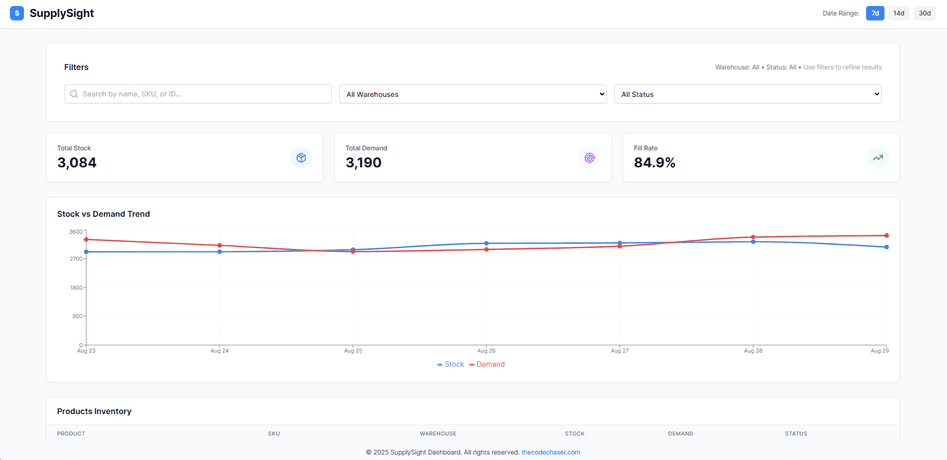
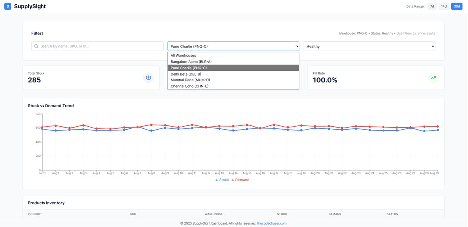
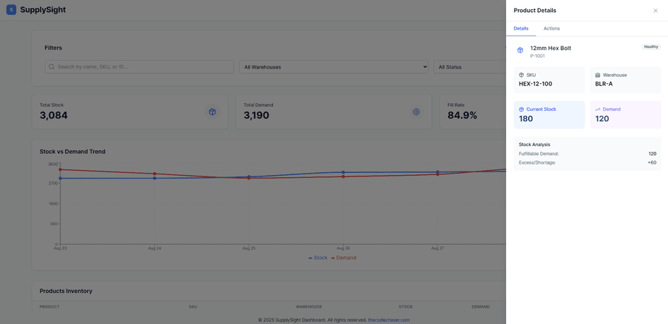

# SupplySight Dashboard

> SupplySight Dashboard is a warehouse analytics tool that helps businesses monitor stock, demand, and fill rates in real time. Users can filter by warehouse, status, or product, and view KPIs alongside interactive trend charts. The dashboard highlights critical inventory issues and provides a clear snapshot of current operations, making it easy to track performance and anticipate demand.

## Preview:







## Built With

- HTML
- CSS
- JavaScript
- REACT
- Graphql
- Apollo Server
- Vite
- Tailwind CSS

## Live version

[SupplySight Dashboard (Coming Soon!)]()

## Getting Started

To get a local copy up and running follow these simple example steps.

### Prerequisites
- A text editor(preferably Visual Studio Code)
- Node
- Web browser

### Install
- [Git](https://git-scm.com/downloads)
- [Node](https://nodejs.org/en/download/)

### Using it Locally

- Clone the project

```bash 
git clone git@github.com:thecodechaser/supply-sight-dashboard.git

cd supply-sight-dashboard
```

- Install dependencies

```bash
npm i 
or
npm install
```
- To Start the garphql server
```bash
node server/server.js
```
- To Start the development server
```bash
npm run dev
```

- To test the project
```bash
npm run test
```


## Visit And Open Files

[Visit Repo](https://github.com/thecodechaser/supply-sight-dashboard)

## Download Repo

[Download Repo](https://github.com/thecodechaser/supply-sight-dashboard/archive/refs/heads/main.zip)

## Authors

👤 **Ranjeet Singh**

- Website: [thecodechaser.com](https://thecodechaser.com)
- GitHub: [@thecodechaser](https://github.com/thecodechaser)
- Twitter: [@thecodechaser](https://twitter.com/thecodechaser)
- LinkedIn: [thecodechaser](https://linkedin.com/in/thecodechaser)

## 🤝 Contributing

Contributions, issues, and feature requests are welcome!

Feel free to check the [issues page](https://github.com/thecodechaser/supply-sight-dashboard/issues).

## Show your support

Give a ⭐️ if you like this project!

## Acknowledgments

- Inspiration: Microverse

## 📝 License

This project is [MIT](./LICENSE) licensed.
